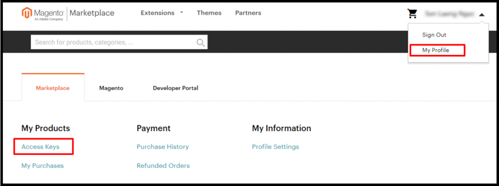
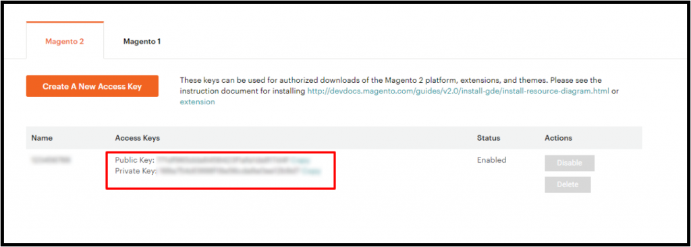
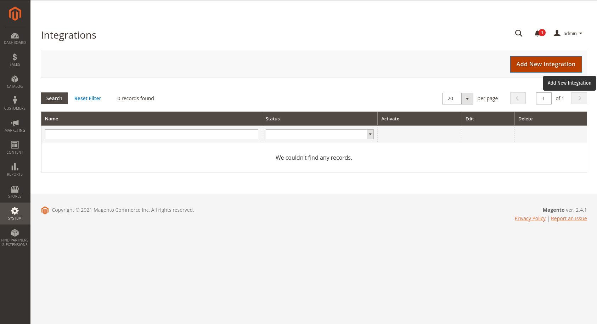
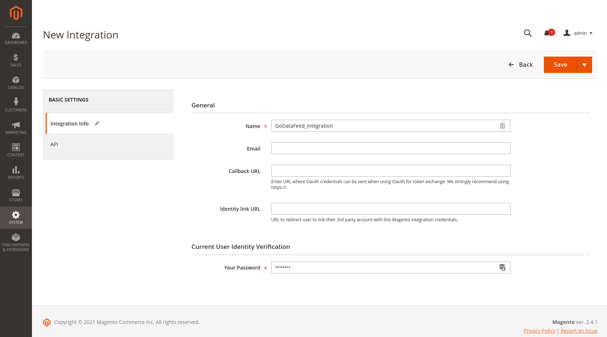
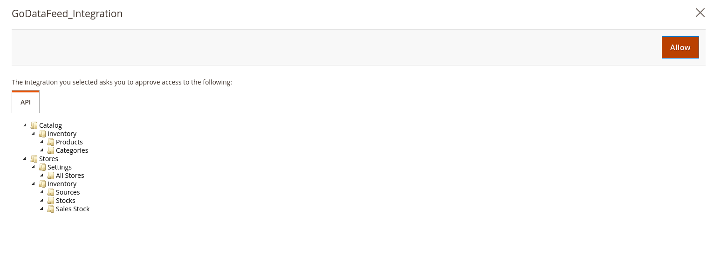
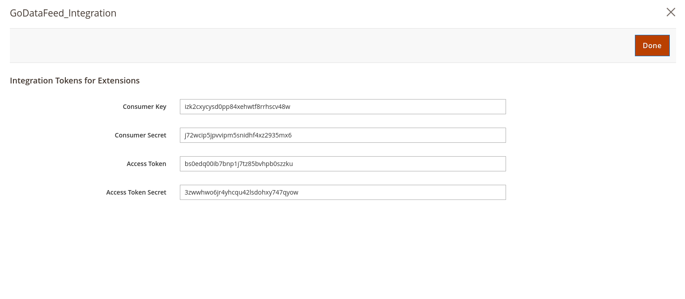

# Installation Instructions
## Prior steps

Prior to installation, you may want to:
- Back up your database and files.
- Enable maintenance mode: `bin/magento maintenance:enable` 

**We strongly recommend to test extension on staging environment before installing it on your live store.**

## Choose your preferred install method

As you may know, there are two most popular ways of installing Magento 2 extensions.
The first one is to use Composer and the second one is to install manually.

We advise users to use Composer method to install our extension.

- [Install From Composer](#install-from-composer)
- [Install From GitHub](#install-from-github)

## Install From Composer

This is also the method that we highly recommend to avoid as many errors as possible during the process.

- It is required to install [Composer](https://getcomposer.org/) first. 
- You must have your access key to install. Navigate to My Profile in Marketplace, then choose Access Keys in My Products section.

- Then, you will get a public key and private key to install the extension.

- Now, let’s  navigate through the following 6 steps to install the extension from Composer:

- **Step 1**: Checkout the [GoDataFeed extension](https://marketplace.magento.com/godatafeed-godatafeed-feed-management.html) from Magento Marketplace
  - Once you have checked out, go to My Profile > My Products > [My Purchases](https://marketplace.magento.com/downloadable/customer/products/)
  - Look for GoDataFeed and click on Technical details.
    - Take note of the latest **Component version**

    
  

- **Step 2**: From Terminal (ssh), navigate to your Magento root directory and run: 
  
  - `php bin/magento maintenance:enable`
  - `cp composer.json composer.json.backup`
  - Now on the command below replace `<version>` with the value from **Step 1**
  - `composer require godatafeed/godatafeed-feed-management:<version> --no-update`
  - `composer update`
  - Example using the screenshot above: `composer require godatafeed/godatafeed-feed-management:2.0.5`
  - This might take few minutes.
  - If Magento asks to enter Username and password. Please enter the following:
    - For username enter your *Public key*
    - For password enter your *Private key*
    - 
  

- **Step 3**: Register the extension by running: 
  - `php bin/magento setup:upgrade`
  

- **Step 4**: You will be asked to recompile Magento. Then run the command: 
  - `php bin/magento setup:di:compile`
  - to generate code and config dependency injection.
  

- **Step 5**: In order to deploy static view files to Magento public directory, use the command:
  - `php bin/magento setup:static-content:deploy`
  

- **Step 6**: Lastly, to disable maintenance mode and clear Magento cache, run:
  - `php bin/magento maintenance:disable`
  - `php bin/magento cache:flush`
  - `php bin/magento cache:clean`
  - Once your store is up and running feel free to remove the backup file created on **Step 2** `composer.json.backup`

For any issue visit the FAQs section of this page.

## Install From Github

- Go to our extension's [latest release page](https://github.com/GoDataFeed/godatafeed-integration-m2/releases/latest)
- Download the latest **FeedManagement.tar.gz** archive

Now, let’s  navigate through the following 10 steps to install the extension from GitHub:

- **Step 1** Upload the downloaded archive into your Magento root directory
  

- **Step 2** From the terminal (ssh), navigate to your Magento root directory
  

- **Step 3** Create the necessary folder structure
  - `mkdir -p app/code/GoDataFeed/FeedManagement`
  

- **Step 4** Extract the contents to *MAGENTO_ROOT_DIRECTORY/app/code* directory
  - Run: `tar -xzf FeedManagement.tar.gz -C app/code/GoDataFeed/FeedManagement` 
  

- **Step 5** Check for proper folder structure
  - Run: `ls app/code/GoDataFeed/FeedManagement`
  - You should see the extension's files.
  

- **Step 6** Enter maintenance mode and enable the extension: 
  - Run: `php bin/magento maintenance:enable`
  - Run: `php bin/magento module:enable --clear-static-content GoDataFeed_FeedManagement`
    

- **Step 7**: Register the extension by running:
  - `php bin/magento setup:upgrade`

- **Step 8**: You will be asked to recompile Magento. Then run the command:
  - `php bin/magento setup:di:compile`
  - to generate code and config dependency injection.

- **Step 9**: In order to deploy static view files to Magento public directory, use the command:
  - `php bin/magento setup:static-content:deploy`

- **Step 10**: Lastly, to disable maintenance mode and clear Magento cache, run:
  - `php bin/magento maintenance:disable`
  - `php bin/magento cache:flush`
  - `php bin/magento cache:clean`
  - Once everything is working feel free to remove the downloaded archive

# Uninstall

* To completely disable the module, run: `php bin/magento module:disable GoDataFeed_FeedManagement`

# Extension Configuration

* Login to your Magento Admin Dashboard

* Go to: System > Extensions > Integrations

* Click: **Add New Integration**
  * 
  * On the **Integration Info** side tab
  * 
    * Add a 'Name'
      * Example: *GoDataFeed_Integration*
    * Under **Current User Identity Verification** add your admin user password
  * On the **API** side tab
    * Under *Resources* grant access to: (make sure a green checkbox is in each box mentioned below)
      * Catalog > Inventory
        
      * Stores > Settings > All Stores
      * Stores > Inventory > Sources
      * Stores > Inventory > Stocks
      * Stores > Inventory > Sales Stocks
        
* Click: The down arrow next to the **Save** button
  * Click: **Save & Activate**
    
  * Click: **Allow**
    
  * Copy all of your Integration Tokens:
    * *Consumer Key*
    * *Consumer Secret*
    * *Access Token*
    * *Access Token Secret*
    

* Go to: Stores > All Stores

* Click on the *Store View* you wish to use for the integration
  * Copy the *store_id* value which will be visible in the URL
    * Example URL: *http://www.your_magento_store.com/admin/system_store/editStore/store_id/**4**/key*
    * In the screenshot below the store_id is **1**
    

# FAQs
- Q: Where can I find my Magento Integration credentions
  - Answer: In the Magento admin go to: Systems > Extensions > Integrations
    - Click on the **Edit** link (pencil shaped icon) on the integration item you wish to see the credentials.
    - On the bottom of the page you will see your **Integration Details**
  

- Q: How to I check of the extension is enabled? 
  - Answer: From the terminal, navigate to the Magento root directory and run:
    - `php bin/magento module:status`
    - You should see `GoDataFeed_FeedManagement` extension on the Enabled extension list
    - You could also view the file `MAGENTO_ROOT_DIRECTORY/app/etc/config.php` there you will see enabled and disabled extensions

- Q: I got error: Could not read /home/magento/.composer/auth.json
  - Answer: run `sudo chmod 777 /home/magento/.composer/auth.json` make sure the file is writable.

- Q: Magento asks me enter Username and password
  - Answer: Go to [Access Keys](https://marketplace.magento.com/customer/accessKeys/) page and Create A New Access Key
    - When Magento asks to enter Username and password. Please enter the following:
      - For username enter your *Public key*
      - For password enter your *Private key*
      - 

# Troubleshooting
* [Visit our help center for troubleshooting or more information.](https://help.godatafeed.com/hc/en-us/sections/115000914112)
